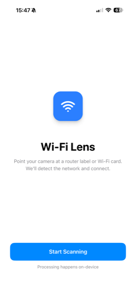
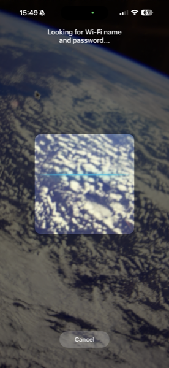
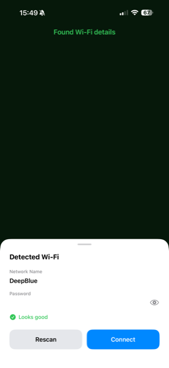
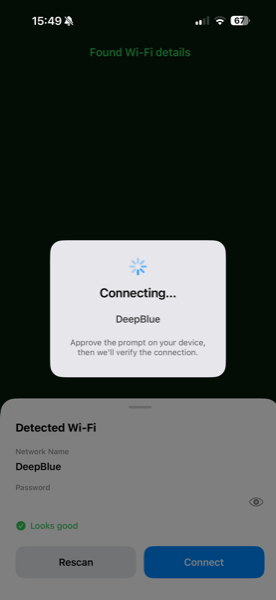
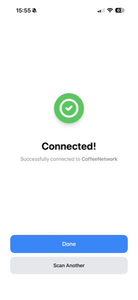

# Wi-Fi Lens

> Point your camera at a router label. Wi-Fi Lens reads the network name and password, then connects with one tap. Pure on-device processing — no account, no tracking, no data leaves your phone.

  
  
  
  
  

## How it works

1. Aim your camera at any printed Wi-Fi credentials — a router label, a Wi-Fi card, a coffee shop sign.
2. On-device text recognition (Vision) extracts the SSID and password in real time.
3. Tap **Connect** — iOS's `NEHotspotConfiguration` handles the secure join.

## Privacy

Wi-Fi Lens does not collect, transmit, or store any personal data. There is no backend, no analytics SDK, no advertising, and no third-party trackers. See the full [privacy policy](https://soapyigu.github.io/wifi-lens/PRIVACY).

## Tech stack

- SwiftUI (iOS 17.6+)
- Vision framework for on-device OCR
- AVFoundation for the camera pipeline
- NetworkExtension (`NEHotspotConfiguration`) for the Wi-Fi join
- Layered architecture: `App/`, `Features/`, `Design/`, `UseCases/`, `Services/`

## Running locally

1. Clone the repo
2. Open `WifiLens.xcodeproj` in Xcode 16+
3. Select a real iPhone (the camera + `NEHotspotConfiguration` don't work in the simulator) and press <kbd>⌘R</kbd>

## Localization

Strings are managed via a single `Localizable.xcstrings` catalog with translations for English, Simplified Chinese, Spanish, Japanese, and French.

## Releases

CI/CD via [fastlane](https://fastlane.tools/):

- `fastlane beta` — build + upload to TestFlight
- `fastlane release_prepare` — push metadata + screenshots to App Store Connect
- `fastlane release_submit` — submit for App Review

Authentication uses an App Store Connect API key (stored locally, gitignored).
